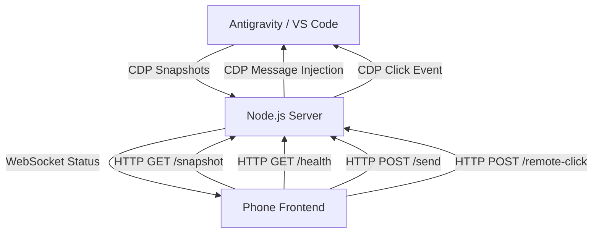

# CODE DOCUMENTATION - Antigravity Phone Connect

## Project Structure
```text
antigravity_phone_chat/
├── server.js           # Main Node.js server (Express + WebSocket + CDP)
├── ui_inspector.js     # Utility for inspecting VS Code/Antigravity UI via CDP
├── public/
│   └── index.html      # Mobile-optimized web frontend
├── start_ag_phone_connect.bat  # Windows launcher
├── start_ag_phone_connect.sh   # Mac/Linux launcher
├── install_context_menu.bat    # Windows context menu manager (Install/Remove/Restart/Backup)
├── install_context_menu.sh     # Linux context menu manager (Install/Remove/Restart/Backup)
├── package.json        # Dependencies and metadata
├── LICENSE             # GPL v3 License
└── README.md           # Quick-start guide
```

## High-Level Architecture
The system acts as a "Headless Mirror" of the Antigravity session running on a Desktop machine. It utilizes the **Chrome DevTools Protocol (CDP)** to bridge the gap between a local VS Code instance and a remote mobile browser.

### Data Flow


## Core Modules & Methods (server.js)
| Module/Function | Description |
| :--- | :--- |
| `getLocalIP()` | Detects local network IP address for mobile access display. |
| `discoverCDP()` | Scans ports (9000-9003) to find the Antigravity instance. |
| `connectCDP()` | Establishes CDP WebSocket with centralized message handling (prevents memory leaks). |
| `captureSnapshot()` | Injects JS into Antigravity to clone the chat DOM, extract CSS, and return it. |
| `loadSnapshot()` (Client) | Renders the HTML snapshot and injects massive CSS overrides for dark mode. |
| `injectMessage()` | Locates the Antigravity input field and simulates typing/submission (uses JSON.stringify for safe escaping). |
| `setMode()` / `setModel()` | Robust text-based selectors to change AI settings remotely. |
| `clickElement()` | Relays a physical click from the phone to a specific element index on Desktop. |
| `getAppState()` | Syncs Mode/Model status by scraping the Desktop UI text nodes (detects clickable elements). |
| `gracefulShutdown()` | Handles SIGINT/SIGTERM for clean server shutdown. |

## API Endpoints
| Endpoint | Method | Description |
| :--- | :--- | :--- |
| `/health` | GET | Returns server status, CDP connection state, and uptime. |
| `/snapshot` | GET | Returns latest captured HTML/CSS snapshot. |
| `/app-state` | GET | Returns current Mode (Fast/Planning) and Model. |
| `/send` | POST | Sends a message to the Antigravity chat. |
| `/stop` | POST | Stops the current AI generation. |
| `/set-mode` | POST | Changes mode to Fast or Planning. |
| `/set-model` | POST | Changes the AI model. |
| `/remote-click` | POST | Triggers a click event on Desktop (for Thought expansion). |
| `/debug-ui` | GET | Returns serialized UI tree for debugging. |

## Dependencies
- **Express**: HTTP server for UI and API endpoints.
- **ws**: WebSocket implementation for real-time update notifications.
- **os**: Node.js built-in for local IP detection.
- **Chrome DevTools Protocol (CDP)**: The underlying bridge to VS Code's browser-based UI.

## Execution Flow
1. **Init**: `server.js` starts and attempts to discover a running Antigravity instance on local ports.
2. **Polling**: Once connected, the server polls the UI every 1 second. If the content hash changes, it notifies clients via WebSocket.
3. **Rendering**: The mobile client receives the notification, fetches the latest HTML/CSS snapshot, and renders it inside a sandboxed div.
4. **Interaction**: User actions (Send, Stop, Change Model) are sent as HTTP POST requests to the server, which converts them into CDP commands executed within the Antigravity host window.
5. **Shutdown**: On SIGINT/SIGTERM, server gracefully closes all connections before exit.

